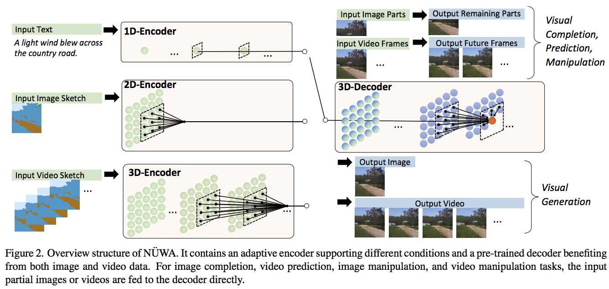

</img>

## NÜWA - Pytorch

<a href="https://discord.gg/xBPBXfcFHd"></a></br>

Implementation of <a href="https://arxiv.org/abs/2111.12417">NÜWA</a>, state of the art attention network for text to video synthesis, in Pytorch. It may also contain an extension into video and audio, using a dual decoder approach.

<a href="https://www.youtube.com/watch?v=InhMx1h0N40">Yannic Kilcher</a>

<a href="https://www.youtube.com/watch?v=C9CTnZJ9ZE0">DeepReader</a>

## Install

```bash
$ pip install nuwa-pytorch
```

## Usage

First train the VAE

```python
import torch
from nuwa_pytorch import VQGanVAE

vae = VQGanVAE(
    dim = 512,
    channels = 3,               # default is 3, but can be changed to any value for the training of the segmentation masks (sketches)
    image_size = 256,           # image size
    num_layers = 4,             # number of downsampling layers
    num_conv_blocks = 2,        # number of convnext blocks
    vq_codebook_size = 8192,    # codebook size
    vq_decay = 0.8              # codebook exponential decay
)

imgs = torch.randn(10, 3, 256, 256)

# alternate learning for autoencoder ...

loss = vae(imgs, return_loss = True)
loss.backward()

# and the discriminator ...

discr_loss = vae(imgs, return_discr_loss = True)
discr_loss.backward()

# do above for many steps

# return reconstructed images and make sure they look ok

recon_imgs = vae(imgs)

```

Then, with your learned VAE

```python
import torch
from nuwa_pytorch import NUWA, VQGanVAE

# autoencoder

vae = VQGanVAE(
    dim = 512,
    num_layers = 4,
    image_size = 256,
    num_conv_blocks = 2,
    vq_codebook_size = 8192
)

# NUWA transformer

nuwa = NUWA(
    vae = vae,
    dim = 512,
    text_num_tokens = 20000,                # number of text tokens
    text_enc_depth = 12,                    # text encoder depth
    text_enc_heads = 8,                     # number of attention heads for encoder
    text_max_seq_len = 256,                 # max sequence length of text conditioning tokens (keep at 256 as in paper, or shorter, if your text is not that long)
    max_video_frames = 10,                  # number of video frames
    image_size = 256,                       # size of each frame of video
    dec_depth = 64,                         # video decoder depth
    dec_heads = 8,                          # number of attention heads in decoder
    dec_reversible = True,                  # reversible networks - from reformer, decoupling memory usage from depth
    enc_reversible = True,                  # reversible encoders, if you need it
    attn_dropout = 0.05,                    # dropout for attention
    ff_dropout = 0.05,                      # dropout for feedforward
    sparse_3dna_kernel_size = (5, 3, 3),    # kernel size of the sparse 3dna attention. can be a single value for frame, height, width, or different values (to simulate axial attention, etc)
    sparse_3dna_dilation = (1, 2, 4),       # cycle dilation of 3d conv attention in decoder, for more range
    shift_video_tokens = True               # cheap relative positions for sparse 3dna transformer, by shifting along spatial dimensions by one
).cuda()

# data

text = torch.randint(0, 20000, (1, 256)).cuda()
video = torch.randn(1, 10, 3, 256, 256).cuda() # (batch, frames, channels, height, width)

loss = nuwa(
    text = text,
    video = video,
    return_loss = True  # set this to True, only for training, to return cross entropy loss
)

loss.backward()

# do above with as much data as possible

# then you can generate a video from text

video = nuwa.generate(text = text, num_frames = 5) # (1, 5, 3, 256, 256)

```

## Conditioning on Sketches (wip)

In the paper, they also present a way to condition the video generation based on segmentation mask(s). You can easily do this as well, given you train a `VQGanVAE` on the sketches before hand.

Then, you will use `NUWASketch` instead of `NUWA`, which can accept the sketch VAE as a reference

ex.

```python
import torch
from nuwa_pytorch import NUWASketch, VQGanVAE

# autoencoder, one for main video, the other for the sketch

vae = VQGanVAE(
    dim = 512,
    num_layers = 4,
    image_size = 256,
    num_conv_blocks = 2,
    vq_codebook_size = 8192
)

sketch_vae = VQGanVAE(
    dim = 512,
    channels = 5,                # say the sketch has 5 classes
    num_layers = 4,
    image_size = 256,
    num_conv_blocks = 2,
    vq_codebook_size = 8192
)

# NUWA transformer for conditioning with sketches

nuwa = NUWASketch(
    vae = vae,
    sketch_vae = sketch_vae,
    dim = 512,                              # model dimensions
    sketch_enc_depth = 12,                  # sketch encoder depth
    sketch_enc_heads = 8,                   # number of attention heads for sketch encoder
    sketch_max_video_frames = 3,            # max number of frames for sketches
    max_video_frames = 10,                  # number of video frames
    image_size = 256,                       # size of each frame of video
    dec_depth = 64,                         # video decoder depth
    dec_heads = 8,                          # number of attention heads in decoder
    dec_reversible = True,                  # reversible networks - from reformer, decoupling memory usage from depth
    enc_reversible = True,                  # reversible encoders, if you need it
    attn_dropout = 0.05,                    # dropout for attention
    ff_dropout = 0.05,                      # dropout for feedforward
    sparse_3dna_kernel_size = (5, 3, 3),    # kernel size of the sparse 3dna attention. can be a single value for frame, height, width, or different values (to simulate axial attention, etc)
    sparse_3dna_dilation = (1, 2, 4),       # cycle dilation of 3d conv attention in decoder, for more range
    shift_video_tokens = True               # cheap relative positions for sparse 3dna transformer, by shifting along spatial dimensions by one
).cuda()

# data

sketch = torch.randn(2, 2, 5, 256, 256).cuda() # (batch, frames, segmentation classes, height, width)
video = torch.randn(2, 10, 3, 256, 256).cuda() # (batch, frames, channels, height, width)

loss = nuwa(
    sketch = sketch,
    video = video,
    return_loss = True  # set this to True, only for training, to return cross entropy loss
)

loss.backward()

# do above with as much data as possible

# then you can generate a video from sketch(es)

video = nuwa.generate(sketch = sketch, num_frames = 5) # (1, 5, 3, 256, 256)

```

## Trainers

This library will offer some utilities to make training easier. For starters, you can use the `VQGanVAETrainer` class to take care of alternating training between the autoencoder (generator) and discriminator during training

```python
import torch
from nuwa_pytorch import VQGanVAE, VQGanVAETrainer

vae = VQGanVAE(
    dim = 256,
    image_size = 256,
    num_layers = 4,
    vq_use_cosine_sim = True
).cuda()

trainer = VQGanVAETrainer(
    vae = vae,
    lr = 3e-4                 # desired learning rate
)

get_batch = lambda: torch.randn(2, 3, 256, 256).cuda()

vae_loss, is_vae_loss = trainer(get_batch())
discr_loss, _         = trainer(get_batch())
vae_loss, _           = trainer(get_batch())
discr_loss, _         = trainer(get_batch())

# ... each forward takes one training step, alternating

# after a lot of steps above, saved trained model

torch.save(vae, f'./trained-vae.pt')
```

## VQ improvements

This library depends on this <a href="https://github.com/lucidrains/vector-quantize-pytorch">vector quantization</a> library, which comes with a number of improvements (improved vqgan, orthogonal codebook regularization, etc). To use any of these improvements, you can configure the vector quantizer keyword params by prepending `vq_` on `VQGanVAE` initialization.

ex. cosine sim proposed in <a href="https://arxiv.org/abs/2110.04627">improved vqgan</a>

```python
from nuwa_pytorch import VQGanVAE

vae = VQGanVAE(
    dim = 256,
    image_size = 256,
    num_layers = 4,
    vq_use_cosine_sim = True
    # VectorQuantize will be initialized with use_cosine_sim = True
    # https://github.com/lucidrains/vector-quantize-pytorch#cosine-similarity
).cuda()
```

## Todo

- [x] complete 3dna causal attention in decoder
- [x] write up easy generation functions
- [x] make sure GAN portion of VQGan is correct, reread paper
- [x] make sure adaptive weight in vqgan is correctly built
- [x] offer new vqvae improvements (orthogonal reg and smaller codebook dimensions)
- [x] batch video tokens -> vae during video generation, to prevent oom
- [x] query chunking in 3dna attention, to put a cap on peak memory
- [x] flesh out VAE resnet blocks, offer some choices
- [x] add all stability tricks from cogview paper by default
- [x] make VQGan able to accept custom VGG for LPAPs loss (audio)
- [x] add feedforward chunking
- [x] add shift token in decoder for cheap powerful RPE
- [x] add reversible networks, to save on memory on depth
- [x] support kernel sizes different along each dimension for sparse 3dna
- [x] add some autotrainer that takes care of the alternating updates of discriminator and VQVAE generator
- [ ] add cosine sim attention from swinv2 as an option
- [ ] offer vqvae training script
- [ ] take care of audio transformer and cross modality attention
- [ ] segmentation mask encoder, make sure embeddings can undergo 3dna attention with decoder during cross attention
- [ ] add audio transformer, and build audio / video nearby cross attention
- [ ] Triton kernel for 3dna attention
- [ ] offer a colab with moving mnist example, conditioned on present digits
- [ ] rotary embeddings for encoder
- [ ] able to add convnext blocks to other layers in vqgan vae - adopt exponentially increasing dimensions through layers
- [ ] make training as easy as running CLI commands, similar to stylegan2-pytorch
- [ ] build NUWA controller class that can accept text or sketch
- [ ] finish 3d-nearby cross attention for sketches
- [ ] handle variable lengthed sketches, accept a mask on the sketch frames dimension

## Citations

```bibtex
@misc{wu2021nuwa,
    title   = {N\"UWA: Visual Synthesis Pre-training for Neural visUal World creAtion}, 
    author  = {Chenfei Wu and Jian Liang and Lei Ji and Fan Yang and Yuejian Fang and Daxin Jiang and Nan Duan},
    year    = {2021},
    eprint  = {2111.12417},
    archivePrefix = {arXiv},
    primaryClass = {cs.CV}
}
```

```bibtex
@misc{ding2021cogview,
    title   = {CogView: Mastering Text-to-Image Generation via Transformers},
    author  = {Ming Ding and Zhuoyi Yang and Wenyi Hong and Wendi Zheng and Chang Zhou and Da Yin and Junyang Lin and Xu Zou and Zhou Shao and Hongxia Yang and Jie Tang},
    year    = {2021},
    eprint  = {2105.13290},
    archivePrefix = {arXiv},
    primaryClass = {cs.CV}
}
```

```bibtex
@misc{kitaev2020reformer,
    title   = {Reformer: The Efficient Transformer},
    author  = {Nikita Kitaev and Łukasz Kaiser and Anselm Levskaya},
    year    = {2020},
    eprint  = {2001.04451},
    archivePrefix = {arXiv},
    primaryClass = {cs.LG}
}
```

```bibtex
@misc{shazeer2020talkingheads,
    title   = {Talking-Heads Attention}, 
    author  = {Noam Shazeer and Zhenzhong Lan and Youlong Cheng and Nan Ding and Le Hou},
    year    = {2020},
    eprint  = {2003.02436},
    archivePrefix = {arXiv},
    primaryClass = {cs.LG}
}
```

```bibtex
@misc{shazeer2020glu,
    title   = {GLU Variants Improve Transformer},
    author  = {Noam Shazeer},
    year    = {2020},
    url     = {https://arxiv.org/abs/2002.05202}    
}
```

```bibtex
@misc{liu2022convnet,
    title   = {A ConvNet for the 2020s},
    author  = {Zhuang Liu and Hanzi Mao and Chao-Yuan Wu and Christoph Feichtenhofer and Trevor Darrell and Saining Xie},
    year    = {2022},
    eprint  = {2201.03545},
    archivePrefix = {arXiv},
    primaryClass = {cs.CV}
}
```

```bibtex
@inproceedings{ho2021classifierfree,
    title   = {Classifier-Free Diffusion Guidance},
    author  = {Jonathan Ho and Tim Salimans},
    booktitle = {NeurIPS 2021 Workshop on Deep Generative Models and Downstream Applications},
    year    = {2021},
    url     = {https://openreview.net/forum?id=qw8AKxfYbI}
}
```

```bibtex
@misc{crowson2022,
    author  = {Katherine Crowson},
    url     = {https://twitter.com/RiversHaveWings/status/1478093658716966912}
}
```
